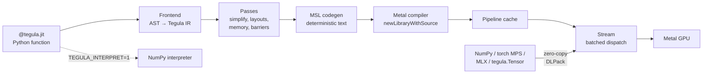

# Tegula implementation plan

Tegula is a Python-embedded, tile-based language for writing GPU compute kernels for Apple
M-series GPUs. You write a kernel as a decorated Python function that operates on tiles,
the way you write Triton kernels. Tegula compiles it to Metal Shading Language (MSL) and
runs it through Metal. Tegula doesn't aim for feature parity with Triton. It aims to be
the fastest way to write a correct, fast custom kernel on a Mac.

The name *tegula* is Latin for a roof tile, which fits a language built on tiles. The
research reports in `docs/research/` use the project's working name, Forge, and the
prototype files keep `forge_` prefixes. Treat both as referring to this project.

This document has two parts:

- [Part 1: Design overview](#part-1-design-overview) is for people. It explains the
  problem, the competitive landscape, the architecture, the key design decisions and the
  evidence behind them, and the roadmap.
- [Part 2: Implementation guide](#part-2-implementation-guide) is for a coding agent. It
  specifies modules, interfaces, algorithms, milestones, acceptance criteria, and working
  rules in enough detail to implement without further design work.

The research behind this plan is in [`docs/research/`](docs/research/). It includes five
reports and verified reference code. Every performance number in this plan was measured
on the development machine unless the plan cites another source: a MacBook Pro with an
M4 Pro (16-core GPU, 24 GB), macOS 27.0, and Xcode 27.

| Report | Contents |
|---|---|
| [`01-triton-internals.md`](docs/research/01-triton-internals.md) | How Triton's frontend, IR, layouts, autotuner, and interpreter work, and what to borrow |
| [`02-apple-gpu-and-metal.md`](docs/research/02-apple-gpu-and-metal.md) | Apple GPU hardware, MSL features, Metal 4 tensors, compile pipeline, debugging tools |
| [`03-prior-art.md`](docs/research/03-prior-art.md) | Competing projects (TileLang, Triton Metal backends, MLX, PyTorch MPS, Mojo, and others) |
| [`04-runtime-bench.md`](docs/research/04-runtime-bench.md) | Python-to-Metal bridge benchmarks, compile and cache cost, zero-copy interop |
| [`05-kernel-bench.md`](docs/research/05-kernel-bench.md) | Achievable bandwidth, softmax, and matmul performance, and the codegen patterns that reach it |

---

# Part 1: Design overview

## The problem

On Apple silicon, you have two ways to run custom GPU compute from Python:

- **Framework ops** (PyTorch MPS, MLX, MPS, MPSGraph). These are fast, but closed. When
  you need a fused operation the framework doesn't have, you can't express it.
- **Hand-written Metal.** This gives full control, but it's verbose and low level. You
  manage threads, SIMD groups, threadgroup memory, barriers, fragment layouts, bounds
  checks, and host-side buffer binding yourself. The string-based escape hatches
  (`mx.fast.metal_kernel`, `torch.mps.compile_shader`) remove the host boilerplate but
  not the kernel-side complexity.

Triton solved this for NVIDIA and AMD GPUs: you write NumPy-like code over tiles, and
the compiler handles the mapping to threads. Tegula brings that model to Apple GPUs.

## The landscape, honestly

The research found that Tegula isn't entering an empty field. As of September 2026, the
following projects overlap with Tegula (details and sources in
[`03-prior-art.md`](docs/research/03-prior-art.md)):

| Project | What it is | Why it doesn't close the gap |
|---|---|---|
| **TileLang** | Python tile DSL on TVM with a Metal target, `simdgroup_matrix` GEMM, and an M5 path | CUDA-first semantics. It depends on a TVM fork. Its programming model is closer to CUTLASS than to Triton. |
| **triton-ext AppleGPU** | Official-org out-of-tree Triton backend that emits MSL | Only elementwise support has merged. The fuller matmul PR is open. It needs a from-source Triton and LLVM build (about an hour). It defers Metal 4. |
| **triton-msl** | Pip-installable Triton-to-MSL alpha from a single author | Its generic lowering handles one element per thread, and it uses hand-written templates for matmul, softmax, and attention. Its attention is 23-44% slower than MLX. |
| **MLX `metal_kernel`, `torch.mps.compile_shader`** | Raw MSL body with generated signature | No tiles, no autotuning, and no bounds help. You write MSL. |
| **Mojo and MAX, Metal.jl, warp-metal, CubeCL** | Other languages or SIMT models | Not Python tile DSLs, or no PyTorch and MLX interop. |

Tegula's niche is therefore specific. Tegula competes on these properties:

1. **Apple-first semantics.** The tile rules, layouts, and matmul lowering come from
   Apple hardware facts: 32-wide SIMD groups, 8x8 `simdgroup_matrix` fragments, direct
   device-to-register loads, and Metal 4 tensor operations. Tegula doesn't port CUDA
   concepts and then work around them.
2. **A light install.** `pip install` works in seconds. Tegula needs no LLVM, MLIR, TVM,
   or Triton build, and it doesn't need the offline Metal toolchain. The compiler is pure
   Python. The only native code is a small Objective-C++ runtime extension.
3. **Framework-neutral interop.** NumPy arrays, PyTorch MPS tensors, and MLX arrays all
   work as kernel arguments with zero copies.
4. **Correctness first.** Tegula refuses unsupported programs with an error at the Python
   source line. It never silently miscompiles. A NumPy interpreter serves as both a
   debugger and a test oracle.

> **Decision needed before you start:** the strategic alternative is to contribute
> Apple-native lowering to TileLang or triton-ext instead of building a standalone
> project. This plan assumes a standalone project, because the light install and
> framework neutrality require one. Revisit this decision if triton-ext ships macOS
> wheels with fast matmul support.

## What using Tegula looks like

The following code shows a vector-add kernel. It reads like Triton, down to the `tl`
alias, so porting a Triton kernel mostly means changing the imports:

```python
import tegula
import tegula.language as tl

@tegula.jit
def add_kernel(x_ptr, y_ptr, out_ptr, n, BLOCK: tl.constexpr):
    pid = tl.program_id(0)
    offs = pid * BLOCK + tl.arange(0, BLOCK)
    mask = offs < n
    x = tl.load(x_ptr + offs, mask=mask)
    y = tl.load(y_ptr + offs, mask=mask)
    tl.store(out_ptr + offs, x + y, mask=mask)

x = tegula.randn(1 << 24)
y = tegula.randn(1 << 24)
out = tegula.empty_like(x)
add_kernel[(tegula.cdiv(x.numel, 1024),)](x, y, out, x.numel, BLOCK=1024)
```

The following code shows a row softmax. The reductions (`tl.max`, `tl.sum`) compile to
SIMD-group shuffles plus one threadgroup-memory exchange:

```python
@tegula.jit
def softmax_kernel(out_ptr, in_ptr, stride_in, stride_out, n_cols,
                   BLOCK: tl.constexpr):
    row = tl.program_id(0)
    cols = tl.arange(0, BLOCK)
    mask = cols < n_cols
    x = tl.load(in_ptr + row * stride_in + cols, mask=mask, other=-float("inf"))
    x = x.to(tl.float32)
    x = x - tl.max(x, axis=0)
    num = tl.exp(x)
    tl.store(out_ptr + row * stride_out + cols, num / tl.sum(num, axis=0), mask=mask)
```

The following code shows a matmul. It uses tensor descriptors, which carry shape and
strides. Descriptors handle out-of-bounds tiles automatically and let the compiler load
matrix fragments straight from device memory:

```python
@tegula.autotune(
    configs=[
        tegula.Config({"BM": 64, "BN": 64, "BK": 32}, num_warps=4),
        tegula.Config({"BM": 32, "BN": 64, "BK": 32}, num_warps=2),
    ],
    key=["M", "N", "K"],
)
@tegula.jit
def matmul_kernel(a_ptr, b_ptr, c_ptr, M, N, K, stride_am, stride_bk, stride_cm,
                  BM: tl.constexpr, BN: tl.constexpr, BK: tl.constexpr):
    pid_n, pid_m = tl.program_id(0), tl.program_id(1)
    a = tl.make_tensor_descriptor(a_ptr, [M, K], [stride_am, 1], [BM, BK])
    b = tl.make_tensor_descriptor(b_ptr, [K, N], [stride_bk, 1], [BK, BN])
    c = tl.make_tensor_descriptor(c_ptr, [M, N], [stride_cm, 1], [BM, BN])
    acc = tl.zeros((BM, BN), dtype=tl.float32)
    for k in range(0, K, BK):
        acc = tl.dot(a.load([pid_m * BM, k]), b.load([k, pid_n * BN]), acc)
    c.store([pid_m * BM, pid_n * BN], acc.to(c.dtype))

grid = lambda meta: (tegula.cdiv(N, meta["BN"]), tegula.cdiv(M, meta["BM"]))
matmul_kernel[grid](a, b, c, M, N, K, a.stride(0), b.stride(0), c.stride(0))
```

To debug any of these kernels on the CPU with `print()` and `pdb`, set
`TEGULA_INTERPRET=1`.

## Architecture

Tegula has a pure-Python compiler and a thin native runtime. The following diagram shows
the flow from a decorated function to a GPU dispatch:



The components are as follows:

- **Frontend.** Parses the kernel's Python AST, evaluates `constexpr` expressions in
  Python, inlines helper functions, and emits Tegula IR: a small, typed, SSA tile IR with
  structured control flow. The frontend reuses Triton's proven approach, and the
  `kernel[grid](...)` launch syntax, `constexpr`, and `grid=lambda meta:` all carry over.
- **Passes.** Simplify the IR, assign a *layout* to every tile (which thread holds which
  element), allocate threadgroup memory, insert barriers, and strength-reduce index math.
- **MSL codegen.** Prints MSL text. Apple's Metal compiler does register allocation and
  instruction scheduling, so Tegula doesn't need LLVM.
- **Runtime.** An Objective-C++ core with a C ABI, exposed through a nanobind extension.
  It compiles MSL, caches pipelines, wraps foreign memory, and batches dispatches into
  command buffers.
- **Interpreter.** Runs the same Python function on the CPU with NumPy, one program at a
  time. It's the debugger and the reference implementation for tests.
- **Autotuner.** Compiles candidate configurations in parallel threads, times them with
  GPU timestamps, and persists the winner per device.

## Key design decisions

Each decision in this section cites the measurement or research finding behind it.

### Emit MSL text, not AIR

AIR, Apple's LLVM-based intermediate format, is undocumented. Projects that emitted it
directly broke across macOS and Xcode updates: an early triton-ext approach, and Mojo on
macOS 27.2. Every live Triton-on-Metal effort moved to MSL text. MSL is also the only
practical route to Metal 4's `matmul2d` tensor operation, which is a C++ header library.

Runtime compilation through `newLibraryWithSource` works without the offline Metal
toolchain, which isn't installed on the development machine. A simple kernel compiles in
about 3 ms plus 4 ms to build the pipeline. Metal caches both stages on disk across
processes, so a repeat compile costs 0.05 to 0.5 ms. For details, see
[`04-runtime-bench.md`](docs/research/04-runtime-bench.md).

### Write the compiler in pure Python

Triton's MLIR stack is what makes a Triton Metal backend a one-hour LLVM build. Tegula's
IR and passes are small enough for Python dataclasses. The Metal compiler handles the
hard back-end work. Tegula's own compile time target is under 20 ms for a matmul kernel,
which is below Metal's own compile cost.

### Use one bit-linear layout representation

A *layout* maps each element of a logical tile to a thread's register. Triton has a zoo
of layout classes with pairwise conversions. Triton's 2025 *linear layouts* work replaced
the zoo with one representation: a map from the bits of (register, lane, SIMD group) to
the bits of the tile coordinates.

Tegula adopts that idea from day one, restricted to power-of-two shapes. The research
confirmed that `simdgroup_matrix` fragments are bit-linear too: each lane holds two
elements whose row comes from lane bits 1, 2, and 4 and whose column comes from lane
bits 0 and 3. So one representation covers elementwise tiles, reduction results, and
matmul accumulators. Reductions, broadcasts, and layout conversions become mechanical
operations on bit bases rather than special cases.

### Lower `dot` to direct-load `simdgroup_matrix`, with Metal 4 `matmul2d` as an option

The kernel benchmarks measured the options at 4096³ on this machine:

| Kernel | FP32 TFLOPS | FP16 TFLOPS |
|---|---|---|
| Threadgroup-memory tiled (no matrix instructions) | 2.17 | 2.35 |
| `simdgroup_matrix`, operands staged through threadgroup memory | 4.68 | 5.43 |
| `simdgroup_matrix`, operands loaded directly from device memory | **5.46** | **5.82** |
| Metal 4 `matmul2d` (Metal Performance Primitives) | **5.64** | **6.19** |
| MPS / MLX (reference) | 5.46 / 5.26 | 6.01 / 5.95 |

The measured compute ceiling is about 6.2 TFLOPS for both FP32 and FP16. FP16 has no 2x
rate on this GPU. Direct device loads beat threadgroup staging by 7-15%, because the GPU
caches supply the reuse and the kernel skips two barriers per K step. So Tegula's default
`dot` lowering loads fragments straight from device memory. The research has a verified
reference kernel at
[`best_matmul.metal`](docs/research/reference/kernels/best_matmul.metal).

Metal 4's `matmul2d` is 3-6% faster on M4 and is the only path to the M5 Neural
Accelerators. It costs about 200 ms to compile, compared with about 10 ms, and its
register layout is opaque, which limits what you can fuse after it. Tegula offers it as a
second `dot` backend: the default on M5 and later, and an autotuning candidate on M4.

### Autotune matmul configurations and verify them

Some per-SIMD-group tile shapes collapse by 7-15x from register spilling. The collapse
depends on the shape and dtype in ways that a register-count model doesn't predict. For
example, FP32 with a 4x4 fragment grid collapses, but FP32 with a 2x8 grid (the same
accumulator count) runs at full speed. Tegula ships a small, pre-validated configuration
set per dtype, autotunes over it, and rejects configurations that run far below the
median.

### Batch dispatches in a stream

Every bridge pays about 95 µs for a synchronous launch-and-wait. The GPU driver sets that
floor. One command buffer per launch caps throughput at about 11 µs per launch, even in
pure C. Batching 64 dispatches per command buffer brings it to 1.1 µs per launch, set by
the GPU. So Tegula launches are asynchronous and batched, like CUDA streams. Tegula commits
a command buffer every 64 dispatches, or when the host needs results.

### Use nanobind over an Objective-C++ C ABI

The following table shows the host cost per dispatch for the bridges the runtime
benchmark measured:

| Bridge | µs per dispatch |
|---|---|
| Pure C loop (floor) | 0.11 |
| **nanobind extension** | **0.17** |
| ctypes, packed record | 0.53 |
| ctypes | 1.15 |
| Raw `objc_msgSend` through ctypes | 1.80 |
| PyObjC | 2.90 |

nanobind also releases the Python GIL around compilation, and compiling eight autotuning
variants on threads ran 6.8x faster than compiling them one at a time. The research has a
working prototype in [`reference/runtime/`](docs/research/reference/runtime/).

### Accept framework tensors through DLPack

PyTorch MPS tensors and MLX arrays both export DLPack with device type `kDLMetal`. Their
data field holds the `id<MTLBuffer>` pointer, plus a byte offset for views. Tegula binds
the buffer directly with no copy. NumPy arrays wrap with `newBufferWithBytesNoCopy`. The
catch is ordering: Tegula's queue and PyTorch's MPS stream don't order against each other.
The benchmark read stale data in 1 of 50 trials without a sync. For PyTorch tensors,
Tegula therefore launches through `torch.mps.compile_shader`, which runs inside PyTorch's
stream (3.4 µs per launch sustained). If that path can't express a kernel, Tegula falls
back to synchronizing.

### Make the interpreter a first-class feature

Tile-level semantics mean each language operation is one NumPy call over a whole tile,
with no thread simulation. That makes the interpreter small. It's also the most valuable
feature per line of code: it gives you `pdb` and `print()` in kernels, and it's the
oracle that every compiled-kernel test compares against. Tegula uses `ml_dtypes` so the
interpreter supports `bfloat16`, which Triton's interpreter doesn't.

### Borrow from Triton, but drop what hurts

The following table summarizes what Tegula takes from Triton, per
[`01-triton-internals.md`](docs/research/01-triton-internals.md):

| Borrow | Simplify | Drop |
|---|---|---|
| `@jit`, `kernel[grid](...)`, `grid=lambda meta:` | Layouts: one bit-linear representation, never exposed to users | Integer `== 1` constexpr specialization, which changes the launcher ABI and causes bugs |
| `constexpr` as compile-time Python | Pipelining: none; Apple GPUs have no async copy engine | Warp specialization, TMA, clusters, FP8 `dot_scaled`, FP64 |
| Specialization on dtype and 16-byte alignment | Memory access: tensor descriptors for matmul, pointer tiles for everything else | `make_block_ptr` (deprecated upstream) |
| `@autotune`, `@heuristics`, `Config` | Autotuning: block sizes and `num_warps` only | A backend plug-in system (one target only) |
| The interpreter, IR dumps, kernel override | Error reporting: every pass reports the Python source line | A lower-level Gluon-style language; a raw MSL escape hatch covers experts |

Tegula specializes on facts such as "this integer is 1" or "this integer is divisible by
16" without removing the argument from the launch signature. The kernel ABI therefore
never changes shape between specializations.

## Performance targets

The following targets apply to the M4 Pro development machine. The ceilings column shows
the best hand-written or library result measured during research.

| Workload | Measured ceiling | Tegula target |
|---|---|---|
| Vector add, 256 MB per array | 238 GB/s | 220 GB/s or more |
| Row softmax, 4096 x 4096, FP32 and FP16 | 230-243 GB/s (MLX 237-254) | 215 GB/s or more |
| LayerNorm and RMSNorm forward, 4096 x 4096 | Not measured; memory bound | 200 GB/s or more |
| Matmul 4096³ FP16, `simdgroup` backend | 5.82 TFLOPS | 5.3 TFLOPS or more (90% of MLX) |
| Matmul 4096³ FP32, `simdgroup` backend | 5.46 TFLOPS | 4.9 TFLOPS or more |
| Matmul 4096³ FP16, `mpp` backend | 6.19 TFLOPS | 5.9 TFLOPS or more |
| Flash attention forward, FP16, head dim 64 and 128 | MLX SDPA (measure in M7) | Within 1.3x of MLX |
| Sustained launch cost, small kernels | 1.1 µs (prototype) | 5 µs or less |
| Tegula compile time, matmul, excluding Metal | Not applicable | 20 ms or less |

## Roadmap

The following table lists the milestones. Each one ends with a working, tested vertical
slice. Sizes are relative: S is a few days of focused work, M is about a week, and L is
two weeks or more.

| Milestone | Delivers | Size |
|---|---|---|
| M0: Runtime and raw kernels | Native runtime, stream, buffers, `tegula.metal_kernel` raw-MSL escape hatch, `tegula.Tensor` | M |
| M1: Frontend, IR, and interpreter | `@tegula.jit` parsing to IR, the full P0 language surface, the NumPy interpreter | M |
| M2: Elementwise codegen | Bit layouts, MSL codegen, specialization, caching; vector add at target | M |
| M3: Reductions and 2D tiles | `sum`, `max`, `min`, `argmax`, broadcasting, layout conversion; softmax and LayerNorm at target | M |
| M4: Matmul | `tl.dot` on `simdgroup_matrix`, tensor descriptors, edge versioning; matmul at target | L |
| M5: Autotuning and benchmarking | `@autotune`, `@heuristics`, `do_bench`, persistent results, benchmark suite | S |
| M6: Framework interop | PyTorch MPS launcher, MLX arrays, DLPack in and out | M |
| M7: Attention, atomics, and scans | Flash attention forward, `atomic_*`, `cumsum`, `associative_scan` | L |
| M8: Metal 4 `matmul2d` backend | `dot_backend="mpp"`, capability gating, M5 default | M |
| M9: Polish and release | Debug printing, `explain()`, error-message pass, docs, tutorials, wheels | M |

## Risks and open questions

- **Competition moves faster than Tegula.** If triton-ext lands fast matmul and macOS
  wheels, the portability argument for Tegula weakens. Mitigation: prioritize what
  incumbents lack, which is a light install, MLX support, and Apple-first ergonomics, and
  ship M0-M4 as the first public release.
- **The `simdgroup_matrix` lane layout is officially unspecified.** MLX and the reference
  kernel depend on it, and it's verified on this M4 Pro. Tegula runs a small self-test
  kernel on first use of each device and refuses the `simdgroup` `dot` path if the
  layout differs.
- **Apple compiler bugs.** The research found three: a single-SIMD-group threadgroup-size
  bound that makes `simdgroup_load` read stale data (CubeCL), miscompiles of unrolled
  4x4-or-larger matrix products (warp-metal), and weak BF16 code generation
  (ThunderMittens). Tegula never emits `max_total_threads_per_threadgroup(32)`, and its
  differential tests cover BF16.
- **Register-spill cliffs** can make a valid configuration 10x slower. Autotuning with
  verification handles this for tuned kernels. Untuned kernels use the pre-validated
  default configuration.
- **Measurement noise.** The GPU also drives the display. It needs about 50 ms of warm-up
  to reach full clocks, and background GPU load caused 2-3x slowdowns during research.
  The benchmark harness warms up, waits for an idle GPU, and reports the minimum of N
  runs.
- **Package name.** On 2026-09-26, `tegula` was unclaimed on PyPI, and the only GitHub
  repository with that name is a small academic project on 2D tilings. Reserve the PyPI
  name early, because the working name `forge` and the alternative `forge-metal` are both
  taken (`forge-metal` is an unrelated Apple-silicon array framework).

---

# Part 2: Implementation guide

This part is written for a coding agent. Read all of it before you start, and read the
research report named in each milestone before you implement that milestone. Where this
guide says *must*, it's a requirement. Where it says *we recommend*, you can deviate if
you record the reason in the milestone's notes.

## Working rules

### Environment

- The machine is an M4 Pro (Apple9 family, `applegpu_g16s`, 16 GPU cores, 32-wide SIMD
  groups, 32 KB threadgroup memory, 1,024 threads per threadgroup), with macOS 27 and
  Xcode 27. It isn't Apple10, so Metal 4 `matmul2d` runs on regular shader cores here.
- Use `uv` for everything: `uv sync`, `uv run pytest`, `uv run python ...`, and
  `uv add`. Don't use `pip` directly.
- Don't download the offline Metal Toolchain (`xcodebuild -downloadComponent
  MetalToolchain`). All MSL compilation happens at run time through
  `newLibraryWithSource`. The product must work without the toolchain.
- The minimum supported OS is macOS 15 (needed for `MTLCompileOptions.mathMode`). The
  minimum GPU family is Apple7 (M1). Gate Metal 4 features at run time.
- Python 3.11 or later.

### Tests

The user explicitly asked for meaningful tests, not many verbose ones. Follow these
rules:

- Every test must be able to fail because of a real bug. Don't test getters, dataclass
  constructors, or that a function exists.
- Prefer one parametrized test over many near-identical tests. A good test covers a
  kernel across two or three shapes (one aligned, one ragged), two or three dtypes, and
  both execution modes (compiled and interpreted).
- The core pattern is differential testing: run the compiled kernel and compare it with
  the interpreter and with a NumPy reference. Put this helper in
  `tests/conftest.py` as `check_kernel(...)` and reuse it everywhere.
- Don't write snapshot tests of full generated MSL. They break on every codegen change
  and catch nothing. A few targeted assertions on generated code are fine, for example
  "the matmul kernel contains `simdgroup_multiply_accumulate` and no `threadgroup`
  declarations."
- Unit-test algorithmic code with small, dense tests: the layout algebra, AxisInfo, and
  the threadgroup-memory allocator. Use a handful of cases each, including edge cases.
- Test error messages for the most common user mistakes only: a missing `constexpr`, a
  non-power-of-two `arange`, threadgroup memory overflow, and an unsupported construct.
  Assert on the source line and a key phrase, not the full text.
- Keep performance out of `pytest`. Performance checks live in `benchmarks/` and run on
  demand.
- The whole default test suite must finish in under 60 seconds on this machine. Mark
  anything slower with `@pytest.mark.slow`.
- Aim for roughly one test file per subsystem and a total count in the low hundreds of
  test cases (after parametrization) by M9, not thousands.

### Benchmarks

- Time GPU work with `MTLCommandBuffer.GPUStartTime` and `GPUEndTime`, never wall clock.
- Warm up for at least 50 ms of GPU work before you measure. The GPU clocks down when
  idle, and a cold first run showed less than half the bandwidth.
- Report the minimum and the median of at least 10 runs.
- Load benchmark operands from memory. The compiler folds MMAs on constant operands and
  reports up to 1.6x the real peak.
- Compare against MLX first, then PyTorch MPS. Both are installed as dev dependencies.
- Expect about 3% noise. Before you conclude that a change regressed performance, rerun.

### Code

- Match the surrounding code. Use type hints and dataclasses. Keep modules small.
- Generated MSL must be deterministic: no timestamps, no memory addresses, no dict-order
  dependence. Metal's front-end cache keys on the exact source text.
- Every IR operation carries a source location. Every error raised after the frontend
  must include it.
- Refuse loudly. If a construct isn't supported, raise `tegula.CompilationError` with the
  source location. Never emit code you aren't sure is correct.
- Commit at the end of each milestone task with a message that says what changed and why.
- At the end of each milestone, append a short entry to `docs/progress.md`: what you
  built, the benchmark numbers, known gaps, and any deviations from this plan.

## Repository layout

Create the following layout in M0. Later milestones fill it in.

```text
./                            # repository root
├── pyproject.toml            # scikit-build-core + nanobind; dist name tegula
├── CMakeLists.txt            # builds tegula._C from Objective-C++
├── PLAN.md                   # this file
├── docs/
│   ├── progress.md           # milestone log (you maintain it)
│   ├── research/             # research reports and reference code (read-only)
│   └── guide/                # user docs (M9)
├── src/tegula/
│   ├── __init__.py           # public API re-exports
│   ├── _C/                   # native runtime (Objective-C++)
│   │   ├── tegula_rt.h        # C ABI
│   │   ├── tegula_rt.mm       # Metal implementation
│   │   └── bindings.mm       # nanobind module
│   ├── runtime/
│   │   ├── device.py         # device singleton, capabilities, self-tests
│   │   ├── tensor.py         # tegula.Tensor, allocation, numpy views
│   │   ├── interop.py        # argument adapters: numpy, DLPack, torch, MLX
│   │   ├── stream.py         # batching stream, synchronize
│   │   ├── launcher.py       # native and torch launch paths
│   │   ├── cache.py          # in-memory and on-disk caches, hashing
│   │   ├── jit.py            # JITFunction, specialization, binder
│   │   ├── autotuner.py      # Autotuner, Config, heuristics
│   │   └── raw.py            # tegula.metal_kernel escape hatch
│   ├── language/
│   │   ├── __init__.py       # the `tl` namespace
│   │   ├── core.py           # dtypes, constexpr, builtin registry
│   │   ├── ops.py            # builtin definitions (one per tl function)
│   │   └── math.py           # math functions
│   ├── compiler/
│   │   ├── ir.py             # types, values, ops, blocks, printer, verifier
│   │   ├── frontend.py       # AST → IR
│   │   ├── semantic.py       # type promotion and broadcasting rules
│   │   ├── layout.py         # BitLayout and layout constructors
│   │   ├── passes/           # one module per pass
│   │   ├── codegen/
│   │   │   ├── msl.py        # IR → MSL text
│   │   │   ├── emitter.py    # indentation-aware source builder
│   │   │   └── prelude.metal # helper functions included in every kernel
│   │   ├── pipeline.py       # runs the passes in order
│   │   └── errors.py         # CompilationError and location formatting
│   ├── interpreter/
│   │   └── interp.py         # NumPy execution of tl builtins
│   └── testing.py            # do_bench, assert_close
├── tests/
├── benchmarks/
└── examples/                 # tutorial kernels (also used by tests)
```

## Dependencies and build

Configure `pyproject.toml` with these settings:

- Build backend: `scikit-build-core`, with `nanobind` as a build requirement.
- Runtime dependencies: `numpy` and `ml_dtypes`.
- Optional extras: `torch` (`tegula[torch]`) and `mlx` (`tegula[mlx]`).
- Dev dependency group: `pytest`, `ruff`, `torch`, and `mlx`.
- `[tool.scikit-build]`: set `wheel.packages = ["src/tegula"]`, set
  `cmake.build-type = "Release"`, and set `MACOSX_DEPLOYMENT_TARGET=15.0`.

Configure `CMakeLists.txt` with these settings:

- `project(tegula LANGUAGES CXX OBJCXX)`.
- `find_package(Python COMPONENTS Interpreter Development.Module REQUIRED)` and
  nanobind's `nanobind_add_module(_C NB_STATIC src/tegula/_C/bindings.mm
  src/tegula/_C/tegula_rt.mm)`.
- Compile flags `-fobjc-arc -std=c++17`. Link `-framework Metal -framework Foundation`.
- Install the module into `tegula/`.

After you change native code, rebuild with `uv sync --reinstall-package tegula`.
Python-only changes need no rebuild. The research prototype built with plain clang in
about 2 seconds (see [`build.sh`](docs/research/reference/runtime/build.sh)), which is a
useful fallback for debugging build problems.

## Milestone M0: Runtime and raw kernels

**Read first:** [`04-runtime-bench.md`](docs/research/04-runtime-bench.md) and the
prototype in [`reference/runtime/`](docs/research/reference/runtime/).

**Goal:** launch hand-written MSL from Python with low overhead, zero-copy buffers, and
batched dispatch.

### Build the native core

Port the prototype's `forge_rt.h` and `forge_rt.mm`, renamed to `tegula_rt.h` and
`tegula_rt.mm`, then change them as follows:

1. Keep the C ABI style: opaque `void*` handles to retained Objective-C objects, released
   with `fr_release`. Keep `@autoreleasepool` around every call that creates autoreleased
   objects.
2. Extend `fr_library_new` to take a struct of compile options: `language_version` (raw
   `MTLLanguageVersion`), `math_mode` (`safe`, `relaxed`, or `fast`),
   `math_fp32_functions` (`fast` or `precise`), `preserve_invariance`, and
   `enable_logging`. Always set `languageVersion` explicitly. The default is 3.2, and MPP
   needs 4.0.
3. Return full compiler diagnostics in the error buffer. Increase the buffer to 64 KB.
4. Add `fr_buffer_from_mtl(ptr)` that retains an existing `id<MTLBuffer>` (for DLPack).
5. Replace the benchmark-only functions with a `Stream` object:
   - `fr_stream_new(queue)` returns a stream holding one open command buffer and one
     serial compute encoder, created lazily.
   - `fr_stream_dispatch(stream, pso, bufs, offsets, nbufs, scalar_bytes, scalar_table,
     nscalars, grid[3], tg[3])` encodes one dispatch. `scalar_table` is an array of
     `(buffer_index, byte_offset, byte_size)` into `scalar_bytes`. Each scalar gets its
     own `setBytes` call at its own buffer index (see [Kernel ABI](#define-the-kernel-abi)).
   - `fr_stream_flush(stream)` ends the encoder and commits the command buffer, then
     signals an `MTLSharedEvent` with an incrementing value.
   - `fr_stream_sync(stream)` flushes, then spin-waits on the shared event's
     `signaledValue` with a short back-off. This was the fastest wait strategy at 79 µs.
   - `fr_stream_pending(stream)` returns the dispatch count in the open command buffer.
   - Set `MTLCommandBufferDescriptor.errorOptions = MTLCommandBufferErrorOptionEncoderExecutionStatus`.
     Record any command-buffer error, and report it at the next sync as a Python
     exception with the kernel name.
6. Add `fr_stream_timed_run(stream, ...)` for benchmarking: it encodes one dispatch in its
   own command buffer, waits, and returns `GPUStartTime` and `GPUEndTime`.
7. Add device queries: name, architecture name, `supportsFamily` for Apple7-Apple10 and
   Metal3 and Metal4, `maxThreadgroupMemoryLength`, `maxThreadsPerThreadgroup`,
   `maxBufferLength`, `recommendedMaxWorkingSetSize`, and
   `maximumConcurrentCompilationTaskCount`.
8. Add pipeline queries: `threadExecutionWidth`, `maxTotalThreadsPerThreadgroup`, and
   `staticThreadgroupMemoryLength`.

### Build the nanobind module

Port `forge_nb.mm` into `bindings.mm` as the module `tegula._C`. The requirements are as
follows:

- Release the GIL (`nb::gil_scoped_release`) in library compilation, pipeline creation,
  and `sync`. Keep it in `dispatch`, which is fast.
- `Stream.dispatch` takes a precomputed native `LaunchPlan` (buffer count and scalar
  table) plus the per-call buffers, offsets, scalar bytes, and grid. This keeps Python
  work per launch to one call.
- Expose `Buffer.ptr` (the `contents` address), `Buffer.nbytes`, and `Buffer.handle`
  (the `id<MTLBuffer>` address, for debugging).

### Build the Python runtime

1. `runtime/device.py`: a lazily created device singleton with a `Capabilities`
   dataclass. The flush threshold is 64 dispatches; make it configurable with
   `TEGULA_FLUSH_EVERY`.
2. `runtime/tensor.py`: `tegula.Tensor` with `shape`, `strides` (in elements), `dtype`,
   `offset`, `numel`, `nbytes`, `stride(i)`, `.numpy()`, `__dlpack__`, and
   `__dlpack_device__`. `.numpy()` synchronizes the default stream, then returns a
   zero-copy view of shared storage. Add `tegula.empty`, `zeros`, `ones`, `full`,
   `randn`, `rand`, `arange`, `empty_like`, `zeros_like`, and `from_numpy` (zero copy when
   the memory is page-aligned, copy otherwise).
3. `runtime/interop.py`: `as_kernel_arg(obj)` returns a `BufferArg(buffer, byte_offset,
   dtype, shape, strides, owner, kind)`. Handle `tegula.Tensor` and NumPy arrays in M0.
   For NumPy, call `newBufferWithBytesNoCopy` only on page-aligned memory (16 KB pages).
   If that returns `nil`, or the memory isn't aligned, copy into a Tegula buffer and copy
   back after the launch for writable outputs. Cache the wrapped buffer per
   `(data pointer, nbytes)` in a small `WeakValueDictionary` keyed on the array's base.
4. `runtime/stream.py`: the Python `Stream` wrapper and `tegula.synchronize()`.
5. `runtime/raw.py`: `tegula.metal_kernel(source, name, language_version=...)` returns a
   launchable object. Its launch syntax is `k[grid, threads_per_group](*args)`. This is
   the expert escape hatch, and M0 tests use it.

### Define synchronization semantics

- Launches that touch only `tegula.Tensor` arguments are asynchronous.
- A launch that touches a NumPy array synchronizes before it returns, because NumPy has
  no stream concept. This is a usability trade-off. Document it and add
  `tegula.async_numpy(True)` to opt out.
- `Tensor.numpy()`, `Tensor.tolist()`, `print(tensor)`, and `tegula.synchronize()` flush
  and wait.

### Acceptance criteria

- A raw-MSL vector add runs correctly on `tegula.Tensor` and on NumPy arrays (aligned and
  unaligned).
- A launch error, for example a missing buffer, raises a Python exception, not a crash.
- A benchmark in `benchmarks/bench_dispatch.py` shows sustained cost of 2 µs or less per
  launch for 10,000 tiny raw launches, and a synchronous round trip of about 100 µs.
- Tests: about five cases in `tests/test_runtime.py`, covering correctness, no-copy
  aliasing in both directions, error propagation, and flush-on-threshold.

## Milestone M1: Frontend, IR, and interpreter

**Read first:** sections 1, 2, and 5 of
[`01-triton-internals.md`](docs/research/01-triton-internals.md).

**Goal:** `@tegula.jit` functions parse into verified Tegula IR, and the interpreter runs
them correctly on the CPU.

### Define the language surface

The `tl` namespace (`tegula.language`) contains the following builtins. P0 items are
required in M1. P1 items arrive in the milestones noted.

| Group | P0 (M1) | P1 (later) |
|---|---|---|
| Program | `program_id(axis)`, `num_programs(axis)` | |
| Creation | `arange(start, end)`, `zeros(shape, dtype)`, `full(shape, value, dtype)`, `zeros_like`, `full_like` | |
| Memory | `load(ptr, mask=None, other=None)`, `store(ptr, value, mask=None)` | `make_tensor_descriptor`, `desc.load`, `desc.store` (M4); `atomic_add`, `atomic_max`, `atomic_min`, `atomic_xchg`, `atomic_cas` (M7) |
| Arithmetic | `+ - * / // % & \| ^ << >> ~ -x`, comparisons, `where`, `maximum`, `minimum`, `fma`, `abs`, `cdiv`, `clamp` | |
| Math | `exp`, `exp2`, `log`, `log2`, `sqrt`, `rsqrt`, `sin`, `cos`, `tanh`, `sigmoid`, `erf`, `floor`, `ceil` | |
| Types | `x.to(dtype)`, `x.to(dtype, bitcast=True)`, dtype objects: `int1`, `int8`, `int16`, `int32`, `int64`, `uint8`, `uint16`, `uint32`, `uint64`, `float16`, `bfloat16`, `float32` | |
| Shape | `x[:, None]`, `x[None, :]`, `broadcast_to`, `expand_dims`, `reshape` (element-order-preserving), `trans`/`permute` | `join`, `split` |
| Reduction | `sum`, `max`, `min`, `argmax`, `argmin` with `axis` and `keep_dims` (lowered in M3) | `reduce(x, axis, combine_fn)` (M3); `cumsum`, `associative_scan` (M7) |
| Matmul | `dot(a, b, acc=None, out_dtype=float32)` (lowered in M4) | |
| Compile time | `constexpr`, `static_range`, `static_assert`, `static_print` | |
| Debug | | `device_print`, `device_assert` (M9) |
| Hints | | `multiple_of`, `max_contiguous` (M2) |

Semantics follow Triton unless noted:

- Tile shapes must be powers of two. Every dimension of every tile must be a power of two
  from 1 to 2^16. Raise a clear error that names the offending dimension.
- Type promotion follows Triton's rules (`semantic.py` in Triton). Scalars promote to the
  tile's dtype when the kind (int or float) matches. `int32 op float32` gives `float32`.
- Integer division and modulo follow C semantics (truncation), as in Triton. Document
  this, because it differs from Python.
- `tl.dot` with FP32 inputs computes in full FP32. There's no TF32 on Apple GPUs.
- `load` with a mask and no `other` returns 0 for masked elements. The value is
  unspecified in Triton, but defining it costs nothing here.
- There are no FP64 types. Passing a `float64` array raises an error that suggests
  casting to `float32`.

### Define kernel arguments

- An array-like argument (`tegula.Tensor`, NumPy array, torch MPS tensor, MLX array)
  becomes a pointer of its dtype, for example `*fp32`. `x_ptr.dtype.element_ty` and the
  shorthand `x_ptr.dtype` both give the element dtype inside the kernel.
- A Python `int` becomes `i32` if it fits in 32 bits, and `i64` otherwise. A `bool`
  becomes `i1`. A `float` becomes `fp32`.
- A parameter annotated `tl.constexpr` is a compile-time value. It becomes part of the
  cache key and is never passed at run time.
- `do_not_specialize=["n"]` on `@tegula.jit` turns off value-fact specialization for the
  named arguments.

### Build the IR

Implement `compiler/ir.py` with these types. Keep it close to MLIR's structure, but in
plain Python:

- **Types:** `ScalarType(name)` for `i1`, `i8`, `i16`, `i32`, `i64`, `u8`, `u16`, `u32`,
  `u64`, `f16`, `bf16`, and `f32`. `PointerType(elem)`. `TileType(shape, elem, layout)`,
  where `elem` is a scalar or pointer type and `layout` is `None` until the layout pass.
  `DescType(elem, shape_rank, block_shape)`.
- **Values:** `Value(type, name_hint)`, produced by exactly one op result or block
  argument.
- **Ops:** `Op(name, operands, results, attrs, regions, loc)`. `Region` holds one `Block`
  with arguments and a list of ops.
- **Printer:** a textual format similar to MLIR generic form. Use it for `TEGULA_DUMP=1`
  and in error messages.
- **Verifier:** checks operand types and counts for every op, single definition,
  dominance, and region terminators. Run it after every pass in debug mode
  (`TEGULA_VERIFY=1`, on by default in tests).

The op set is as follows. Every op has a verifier rule and an interpreter rule.

| Category | Ops |
|---|---|
| Constants and creation | `const`, `splat`, `arange`, `full` |
| Program | `program_id`, `num_programs` |
| Arithmetic | `binary` (`add`, `sub`, `mul`, `div`, `floordiv`, `mod`, `and`, `or`, `xor`, `shl`, `shr`, `min`, `max`), `cmp` (`eq`, `ne`, `lt`, `le`, `gt`, `ge`), `unary` (`neg`, `not`, `abs`, and all math functions), `fma`, `select`, `cast`, `bitcast` |
| Shape | `broadcast`, `expand_dims`, `reshape`, `trans` |
| Memory | `addptr`, `load`, `store`, `make_desc`, `desc_load`, `desc_store`, `atomic_rmw`, `atomic_cas` |
| Compute | `dot`, `reduce` (with a `kind` attribute or a combine region), `scan` |
| Control flow | `for` (lower bound, upper bound, step, iteration arguments, body region ending in `yield`), `if` (condition, then and else regions ending in `yield`, results), `while` (P1) |
| Layout (added by passes) | `convert_layout`, `local_alloc`, `local_store`, `local_load`, `barrier` |
| Debug | `print`, `assert` |

### Build the frontend

Implement `compiler/frontend.py` as an `ast.NodeVisitor` modeled on Triton's
`CodeGenerator`:

1. Get the source with `inspect.getsource`, dedent it, and parse it. Record the file name
   and first line number so every node maps to a real `file:line:col`.
2. Resolve names in this order: local variables, then kernel parameters, then the
   function's globals (for `tl`, helper functions, and global constants), then builtins.
3. Treat any value derived only from constexprs and Python literals as a compile-time
   Python value, and fold it in Python. This makes Python the metaprogramming language.
4. `if` on a compile-time condition emits only the taken branch. `if` on a runtime
   scalar emits an `if` op, and values assigned in both branches become results. `if` on
   a tile raises an error that suggests `tl.where`.
5. `for i in range(...)` emits a `for` op. Variables that are assigned in the body and
   live after it become iteration arguments. `for i in tl.static_range(...)` unrolls in
   the frontend.
6. Calls to other `@tegula.jit` functions are inlined at the AST level with their own
   scope. Recursion is an error.
7. Forbid the following with clear errors: `break`, `continue`, `return` with a value in
   a kernel, `return` inside a runtime `if` or `for`, `while` (until P1), closures over
   tiles, lists of tiles, `try`, `with`, `global`, and `nonlocal`. Tuples of values are
   allowed.
8. `semantic.py` implements broadcasting and type promotion so that the frontend stays a
   thin dispatcher.

### Build the interpreter

Implement `interpreter/interp.py`. Don't interpret the IR. Run the Python function
directly, the way Triton's interpreter does:

1. Each `tl` builtin in `language/ops.py` has two implementations registered in one
   place: a frontend handler that emits IR, and an interpreter handler that computes on
   NumPy. A decorator such as `@builtin(interp=_interp_load)` keeps them together.
2. Tiles are `ITile(np.ndarray)` wrappers that implement the operators. Use `ml_dtypes`
   for `bfloat16`. Compute FP16 and BF16 arithmetic in FP32 and round the result to the
   tile dtype after each op. This matches GPU behavior closely enough for tolerance-based
   tests.
3. Pointers are `IPointer(flat_array_view, offsets)`. `load` and `store` index the flat
   view with the offsets and honor masks. Out-of-bounds unmasked access raises an
   `IndexError` that names the kernel line, which is a debugging feature the GPU can't
   offer.
4. The grid runs sequentially. Set `program_id` values before each program.
5. Activate the interpreter with `TEGULA_INTERPRET=1` or `@tegula.jit(interpret=True)`.
   Arrays pass through as NumPy views of shared memory, so no copies are needed.

### Acceptance criteria

- The examples `examples/01_vector_add.py`, `02_softmax.py`, `03_layernorm.py`, and
  `04_matmul.py` run correctly under the interpreter. Matmul uses pointer tiles in M1;
  M4 adds the descriptor version.
- `TEGULA_DUMP=1` prints readable IR for each example.
- Tests: the frontend error cases listed in [Tests](#tests), and interpreter checks
  against NumPy for the four examples.

## Milestone M2: Layouts, codegen, and elementwise kernels

**Read first:** section 3 of [`01-triton-internals.md`](docs/research/01-triton-internals.md),
sections 2, 5, and 6 of [`02-apple-gpu-and-metal.md`](docs/research/02-apple-gpu-and-metal.md),
and experiment 1 of [`05-kernel-bench.md`](docs/research/05-kernel-bench.md).

**Goal:** vector add, and any elementwise kernel, compiles to MSL and runs at target
bandwidth.

### Implement `BitLayout`

`compiler/layout.py` defines one layout class:

```python
@dataclass(frozen=True)
class BitLayout:
    shape: tuple[int, ...]              # all powers of two
    reg: tuple[tuple[int, ...], ...]    # basis per register bit
    lane: tuple[tuple[int, ...], ...]   # exactly 5 bases (32 lanes)
    warp: tuple[tuple[int, ...], ...]   # log2(num_warps) bases
```

Each basis is a coordinate vector with exactly one nonzero power-of-two entry, or all
zeros. A zero basis means *broadcast*: the threads that differ only in that bit hold the
same element. The logical coordinate of a (register `r`, lane `l`, SIMD group `w`) triple
is the XOR of the bases for the set bits of `r`, `l`, and `w`. Because all bases are
single-bit, XOR equals addition here.

Implement the following functions, each with a docstring and a small unit test:

- `blocked(shape, num_warps, elem_bytes, order)`: the default layout. Fill bits in this
  order: register bits along the fastest dimension until each thread holds 16 bytes
  contiguously (4 FP32 or 8 FP16 elements), then lane bits along the fastest dimension,
  then lane bits along the next dimensions, then SIMD-group bits the same way, then any
  remaining register bits (repetitions). If the tile has fewer elements than threads,
  the leftover lane or SIMD-group bits get zero bases. For a 1D tile, this yields the
  interleaved pattern that measured 230-238 GB/s: thread `t` handles elements
  `t*VEC + j*(threads*VEC)`.
- `slice(layout, dim)`: removes `dim` from the shape. Bases that pointed into `dim`
  become zero. This is the layout of a reduction result, and of an `arange` that feeds
  `x[:, None]`.
- `expand(layout, dim)`: inserts a size-1 dimension.
- `broadcast(layout, dim, size)`: grows a size-1 dimension. The new coordinate bits come
  from register bits added as new bases (each thread holds all broadcast copies). This
  is the inverse of `slice` for broadcast.
- `simd_acc(BM, BN, WM, WN)`: the `simdgroup_matrix` accumulator layout (see
  [M4](#milestone-m4-matmul)).
- `num_regs(layout)`, `owner_mask(layout)` (which lane and SIMD-group bits are zero
  bases), `is_equivalent(a, b)`.
- `coords_of(layout, r)`: the compile-time coordinate offsets of register `r`, plus a
  symbolic lane and SIMD-group contribution. Codegen uses this to emit per-register index
  expressions.

### Implement the passes

`compiler/pipeline.py` runs these passes in order. Each pass lives in its own module in
`compiler/passes/`:

1. `simplify`: constant folding, algebraic identities, CSE, and DCE.
2. `axis_info`: a forward analysis that computes, per dimension of each integer or
   pointer tile, its *contiguity* (runs of consecutive values), *divisibility* (the
   largest power of two dividing every value), and *constancy* (runs of equal values).
   Seed it from `arange` (contiguity = size), `splat` (constancy = size), specialization
   facts on arguments (divisible by 16), and `multiple_of` hints. Propagate through
   `add`, `sub`, `mul` by constant, `broadcast`, and `expand_dims`. Triton's `AxisInfo`
   is the reference.
3. `assign_layouts`: give every tile value a `BitLayout`:
   - *Anchors:* `load` and `store` get `blocked` with the order from `axis_info`
     (contiguous dimension fastest). `dot` gets `simd_acc` (M4). `reduce` produces
     `slice` of its input.
   - Propagate layouts forward through elementwise ops. When an elementwise op's operands
     disagree, choose the layout of the operand that came from a load or `dot`, and
     convert the others.
   - *Rematerialize instead of converting* when the value comes from a cheap source
     (`arange`, `splat`, `full`, `const`, or elementwise ops over only those). Such a
     value can be recomputed directly in any layout at no cost. This one rule removes
     most conversions in real kernels.
   - Otherwise, insert `convert_layout`.
4. `lower_convert_layout`: if the two layouts are equivalent, delete the conversion. If
   they differ only in register order, emit register moves. Otherwise, lower to
   `local_alloc`, `local_store` with the source layout, `barrier`, and `local_load` with
   the destination layout. Pad the innermost dimension of the threadgroup buffer by
   `16 / elem_bytes` elements when its size is a power of two of 16 or more. Power-of-two
   strides of 16 or more measured 3-5x slower.
5. `alloc_threadgroup_memory`: compute live ranges of `local_alloc` buffers and assign
   offsets in one threadgroup arena with a greedy interval allocator. Align each buffer to
   16 bytes. If the total exceeds `maxThreadgroupMemoryLength` (32 KB), raise an error at
   the source line of the largest allocation that names its size and suggests smaller
   blocks.
6. `insert_barriers`: insert `threadgroup_barrier(mem_flags::mem_threadgroup)` between a
   write and a later read of the same buffer region by other threads, and between a read
   and a later overwrite (write-after-read). The first version can be conservative: a
   barrier before every `local_load` that follows a `local_store`, and before every
   buffer reuse.
7. `strength_reduce`: replace integer `//` and `%` by powers of two with shifts and masks,
   and hoist loop-invariant index math out of `for` bodies. Integer division measured
   about 50x slower than FMA.

### Implement MSL codegen

`compiler/codegen/msl.py` walks the final IR and emits one kernel. The structure is:

```metal
#include <metal_stdlib>
using namespace metal;
// prelude.metal contents (helpers), included verbatim

[[kernel]] void KERNEL_NAME(
    device const float* x_ptr [[buffer(0)]],
    device const float* y_ptr [[buffer(1)]],
    device float* out_ptr [[buffer(2)]],
    constant int& n [[buffer(3)]],
    uint3 pid [[threadgroup_position_in_grid]],
    uint3 npid [[threadgroups_per_grid]],
    ushort lane [[thread_index_in_simdgroup]],
    ushort warp [[simdgroup_index_in_threadgroup]]) {
  // body
}
```

The codegen rules are as follows:

- **Tile values become per-thread register arrays.** A tile with `R = num_regs(layout)`
  registers becomes `T v[R];`. Elementwise ops become loops over `R` preceded by
  `#pragma unroll`, with compile-time-constant indices. Never index a register array
  with a runtime value, because that forces the array onto the stack. Warn at compile
  time if any tile needs more than 128 32-bit registers per thread, and error above 256.
- **Scalars become plain locals.** Program IDs, arguments, loop counters, and full
  reductions are uniform across the threadgroup.
- **Index math uses `int` by default.** If any tensor argument is at least 2^31 bytes,
  the launcher adds `idx64` to the specialization key, and codegen uses `long` offsets.
- **Pointer tiles** become a base pointer plus an `int` offset array. `load` becomes
  `v[r] = mask[r] ? base[off[r]] : other[r];`. When `axis_info` proves that each thread's
  registers are contiguous in groups of `VEC` and aligned to `VEC` elements, emit one
  vector load (`*(device const float4*)(base + off[r])`) per group. Vectorization barely
  changed bandwidth in the benchmarks, so implement the scalar path first and add
  vectorization after the tests pass.
- **Broadcast (zero) bases in lane or SIMD-group bits** mean that several threads hold
  the same element. Predicate `store` and atomics so that only the owner writes. The
  owner is the thread whose zero-basis bits are all 0.
- **Control flow:** `for` becomes a C `for` loop over `int` with iteration arguments as
  mutable locals declared before the loop and reassigned at the `yield`. `if` becomes a C
  `if` with result locals.
- **Names:** derive MSL identifiers from Python names with a numeric suffix
  (`acc_3`), so that generated code is readable. Escape MSL reserved words.
- **Source mapping:** emit a `// file.py:LINE` comment before the code for each IR op in
  debug mode (`TEGULA_DEBUG=1`). Don't emit these comments by default. They're
  deterministic, but they make the source text larger.
- **Math mode:** compile with `mathMode = relaxed` by default, which keeps `inf` and NaN
  semantics for masking with `-inf`. Add `@tegula.jit(math_mode="fast")` for kernels that
  are bound by `exp`. Fast mode measured 1.8x faster `exp`, but it assumes no infinities.
  Write a test that a softmax with `other=-float("inf")` and fully masked lanes gives the
  right answer under the default mode.
- **Language version:** 3.2 by default, 4.0 when the kernel uses MPP.

### Define the kernel ABI

- Runtime arguments bind in declaration order, after constexprs are removed: argument
  `i` binds at `[[buffer(i)]]`.
- Pointers become `device T*` (or `device const T*` if the kernel never stores through
  them). Scalars become `constant T& name`.
- The total must fit in 31 buffer slots. Raise an error for more than 31 runtime
  arguments.
- The threadgroup size is `num_warps * 32`. The default `num_warps` is 4. Never emit a
  `max_total_threads_per_threadgroup` attribute of 32, because of the Apple compiler bug
  found by CubeCL.
- The launch uses `dispatchThreadgroups` with the grid as threadgroup counts, one
  threadgroup per program, like Triton. Validate the grid against device limits and
  raise an error rather than truncating.

This ABI works for both the native launcher and `torch.mps.compile_shader` (M6), so one
generated source serves both.

### Implement specialization and caching

`runtime/jit.py` implements `JITFunction`:

1. At decoration time, capture the source, the signature, constexpr parameters, and a
   dependency hash: SHA-256 over the kernel source plus every transitively referenced
   `@tegula.jit` function and global constant (Triton's `DependenciesFinder` pattern).
2. At call time, build the specialization key: for each runtime argument, the dtype and
   16-byte alignment for arrays, or the Python type, bit width, `value % 16 == 0`, and
   `value == 1` for integers; plus all constexpr values, `num_warps`, the math mode, and
   `idx64`. Integer facts become IR attributes that `axis_info` uses. They never remove
   the argument.
3. Look up the key in a per-function dict. On a miss, compile: frontend, passes, codegen,
   Metal compile, and pipeline creation. On a hit, go straight to launch.
4. Make the hit path fast. Build the per-argument key extractors once per signature.
   Precompile a `struct.Struct` for the scalar bytes and a native `LaunchPlan` per
   specialization. Target 5 µs or less of host time per launch, measured in
   `benchmarks/bench_dispatch.py`.
5. Keep an on-disk cache in `~/.cache/tegula/<key-hash>/` with `kernel.metal`, `ir.txt`,
   and `meta.json`. The key hash includes the dependency hash, the specialization key,
   the Tegula version, the OS build, and `device.architecture.name`. Metal's own disk
   cache handles the compiled binaries, so Tegula doesn't store them in M2.
6. Warn once per kernel after 16 recompilations, and name the argument whose
   specialization changed most.
7. Support `TEGULA_ALWAYS_COMPILE=1` (ignore caches), `TEGULA_DUMP=1` (write IR and MSL next
   to the cache entry and print their paths), and `TEGULA_OVERRIDE_DIR` (load hand-edited
   MSL from `<dir>/<kernel_name>.metal` instead of generated code).
8. Expose `compiled = kernel.warmup(*args, grid=...)`, with `compiled.msl`,
   `compiled.ir`, `compiled.threadgroup_memory_bytes`, and `compiled.num_warps`.

### Acceptance criteria

- `examples/01_vector_add.py` passes differential tests for FP32, FP16, and BF16 at sizes
  1, 1000, and 2^20 + 3.
- A fused elementwise example (`examples/05_fused_gelu.py`: GELU of `x * scale + bias`)
  passes.
- `benchmarks/bench_elementwise.py` shows vector add at 220 GB/s or more at 256 MB per
  array.
- Tegula compile time (frontend through codegen) is under 5 ms for vector add.

## Milestone M3: Reductions and 2D tiles

**Read first:** experiment 2 of [`05-kernel-bench.md`](docs/research/05-kernel-bench.md).

**Goal:** softmax, LayerNorm, and RMSNorm compile and run at target bandwidth.

### Lower `reduce`

For `reduce(x, axis=d, kind)`, look at the bases in `x`'s layout that map into dimension
`d`:

1. **Register bases:** combine the registers in-thread, in a tree.
2. **Lane bases:** for each lane basis that maps into `d`, apply
   `simd_shuffle_xor(v, 1 << bit)` and combine. When all 5 lane bits map into `d`, use
   `simd_sum`, `simd_max`, or `simd_min` directly. Put these helpers in `prelude.metal`.
3. **SIMD-group bases:** write each SIMD group's partial to a threadgroup scratch buffer
   (`local_alloc` sized to the SIMD-group extent along `d` times the rest), `barrier`,
   then read and combine. This is the "simd, then one exchange, then simd" pattern that
   measured flat across threadgroup sizes. A tree over threadgroup memory lost 30% at 1024
   threads in FP16.
4. The result has layout `slice(x.layout, d)`.

Additional rules:

- Accumulate FP16 and BF16 reductions in FP32. Cast the result back to the input dtype
  unless the user asked for FP32 with `.to()` first. Triton does the same.
- `bfloat` isn't a valid type for `simd_shuffle` or `simd_sum`. Bitcast to `ushort` for
  shuffles, and reduce in FP32.
- `argmax` and `argmin` reduce `(value, index)` pairs. Break ties toward the lower index,
  as NumPy does.
- A `reduce` with a user combine function (`tl.reduce(x, axis, fn)`) inlines `fn` at each
  combine step. Use it to implement Welford variance in a test.

### Handle 2D tiles and broadcasting

- `x[:, None] + y[None, :]` must work without layout conversions when both operands come
  from `arange`, through the rematerialization rule in `assign_layouts`.
- Reductions over the inner dimension of a 2D blocked tile, followed by a broadcast back
  (`x - tl.max(x, axis=1)[:, None]`), must not convert layouts. The `slice` and
  `broadcast` functions make this automatic, so add a test that asserts zero
  `convert_layout` ops for this pattern.

### Acceptance criteria

- `examples/02_softmax.py` (one row per program), `03_layernorm.py`, and
  `06_rmsnorm.py` pass differential tests for FP32 and FP16, including a ragged column
  count (1000) and a fully masked tail.
- `benchmarks/bench_softmax.py` shows 215 GB/s or more for 4096 x 4096 in FP32 and FP16,
  side by side with MLX and torch.
- A reduction microbenchmark shows no more than 5% variation between 128 and 1,024
  threads per threadgroup.

## Milestone M4: Matmul

**Read first:** experiment 3 of [`05-kernel-bench.md`](docs/research/05-kernel-bench.md),
section 2 of [`02-apple-gpu-and-metal.md`](docs/research/02-apple-gpu-and-metal.md), and
the reference kernel
[`best_matmul.metal`](docs/research/reference/kernels/best_matmul.metal). The generated
matmul kernel must be structurally equivalent to that reference kernel.

**Goal:** `tl.dot` compiles to `simdgroup_matrix` code that reaches 90% of MLX.

### Define the fragment layout

In a `simdgroup_matrix<T, 8, 8>`, each lane holds two elements, `thread_elements()[0]`
and `[1]`. The lane-to-coordinate map, from MLX and verified by the reference kernel, is
as follows:

```text
row = (lane >> 2 & 4) + (lane >> 1 & 3)    # lane bits 1, 2 -> row 1, 2; bit 4 -> row 4
col = (lane >> 1 & 4) + (lane << 1 & 2)    # lane bit 0 -> col 2; bit 3 -> col 4
element e in {0, 1} adds e to col          # register bit 0 -> col 1
```

So `simd_acc(BM, BN, WM, WN)` is a `BitLayout` with these bases:

- `reg`: `(0, 1)` for the element bit, then `(0, 8), (0, 16), ...` for the `TN = BN /
  (8 * WN)` fragment columns, then `(8, 0), (16, 0), ...` for the `TM = BM / (8 * WM)`
  fragment rows.
- `lane`: `(0, 2), (1, 0), (2, 0), (0, 4), (4, 0)` for lane bits 0 to 4.
- `warp`: `(SM, 0), (2 * SM, 0), ...` for the `WM` SIMD-group rows, then
  `(0, SN), ...` for the `WN` columns, where `SM = BM / WM` and `SN = BN / WN`.

Consequences for codegen:

- An accumulator tile is emitted as `simdgroup_float8x8 acc[TM][TN];`. The register array
  view used by elementwise ops is `acc[i][j].thread_elements()[e]`, so elementwise
  epilogues (bias, activation, scaling, casts) need no conversion.
- A row reduction over the accumulator (needed by attention) reduces the element bit and
  the fragment-column bits in-thread, then shuffles over lane bits 0 and 3 (XOR masks 1
  and 8), then goes through threadgroup memory only if `WN > 1`.
- Because the lane layout is officially unspecified, `runtime/device.py` runs a self-test
  on first use of the `simdgroup` `dot` path: a kernel writes each lane's coordinates for
  an identity-like matrix and the runtime checks the mapping. On a mismatch, `dot` raises
  an error that explains the situation.

### Lower `dot`

Implement `passes/lower_dot.py` and the codegen for it:

1. **Choose the SIMD-group grid.** The default is `WN = 1` and `WM = num_warps`, which is
   the measured best configuration (4 SIMD groups along M, each owning a 16 x 64 strip).
   It also makes the attention `P @ V` conversion free (see M7). Allow an override with
   `tegula.Config(..., dot_warps=(WM, WN))`. Require `BM % (8 * WM) == 0` and
   `BN % (8 * WN) == 0`, and require `BK % 8 == 0`.
2. **Classify each operand.**
   - *Direct operand:* the operand is a `desc_load` (optionally through `trans`) with no
     other users, from a descriptor whose innermost stride is known to be 1 (a literal 1
     or a specialized `== 1` fact). Don't materialize it. At the `dot`, emit
     `simdgroup_load(frag, base + row * ld + col, ld)` per fragment, straight from device
     memory, with `transpose_matrix = true` for a transposed operand. Each SIMD group
     loads only the fragments it needs: `TM x (BK/8)` for A and `(BK/8) x TN` for B.
   - *Staged operand:* anything else, such as a pointer-tile `load` or a computed tile.
     Write it to threadgroup memory in its layout, `barrier`, and `simdgroup_load` from
     threadgroup memory. This measured 7-15% slower but is fully general. Pad rows by 16
     bytes.
   - *Register operand:* an FP16 or FP32 tile whose layout is already `simd_acc` with a
     compatible shape and `WN = 1` becomes the left operand by copying
     `thread_elements()` with a cast. This path serves attention in M7.
3. **Emit the MMA loop:** for each `kk` in `BK / 8`, load the A and B fragments, then run
   `simdgroup_multiply_accumulate(acc[i][j], a[i], b[j], acc[i][j])` over `TM x TN`.
   Mixed precision (FP16 or BF16 operands with an FP32 accumulator) runs at full rate.
4. **Supported dtypes:** operands in FP16, BF16, or FP32, and an accumulator in FP32 (the
   default) or FP16. Integer `dot` raises an error in M4 and gets the MPP path in M8.

### Implement tensor descriptors

- `tl.make_tensor_descriptor(ptr, shape, strides, block_shape)` produces a `DescType`
  value. `block_shape` must be constexpr powers of two. The last stride must be 1, or the
  call raises an error that explains why.
- `desc.load(offsets)` loads the block at element offsets `offsets` and zero-fills
  out-of-bounds elements. `desc.store(offsets, tile)` skips out-of-bounds elements.
- Outside a direct `dot` operand, `desc_load` lowers to a `blocked` load with a mask
  derived from the bounds.

### Implement edge versioning

Per-lane masked fragment loads on every tile cost about 45%. Checking only edge tiles
costs 0-1% on aligned sizes. Implement `passes/edge_versioning.py`:

1. For a `for` loop that contains direct-operand `desc_load` ops, compute a
   threadgroup-uniform condition that's true when every such load in every iteration is
   in bounds along its non-loop dimensions (M and N for a matmul). The condition uses only
   program IDs, descriptor shapes, and constexpr block sizes.
2. Emit `if (interior) { loop with unmasked loads } else { loop with checked loads }`.
   In the checked loop, each fragment load tests `rows_left >= 8 && cols_left >= 8`,
   which is uniform across the SIMD group, and falls back to a masked per-lane load
   through `thread_elements()` only for straddling fragments.
3. Peel the last iteration of the loop when the loop dimension (K) isn't known to be a
   multiple of the block size, and use checked loads there. Use the specialization fact
   `K % 16 == 0` with `BK <= 16` to skip the peel.
4. Apply the same interior test to `desc_store` in the epilogue, and store two elements
   per lane as a `vec<T, 2>` in the interior path.

### Acceptance criteria

- `examples/04_matmul.py` has two variants: descriptor-based (fast path) and
  pointer-tile-based (staged path). Both pass differential tests for FP32, FP16, and BF16
  at 64³, 513³, 1000 x 777 x 300, and 2048³.
- A test asserts that the descriptor matmul's generated MSL contains
  `simdgroup_multiply_accumulate` and no `threadgroup` arrays.
- `benchmarks/bench_matmul.py` at 4096³ reports FP16 at 5.3 TFLOPS or more and FP32 at
  4.9 TFLOPS or more, alongside MLX, torch, and MPS. It also reports 2000³ and 513³ to
  track ragged-size cost.
- `examples/07_matmul_fused.py` (matmul plus bias plus GELU epilogue) runs within 5% of
  plain matmul.

## Milestone M5: Autotuning and benchmarking

**Read first:** section 4 of [`01-triton-internals.md`](docs/research/01-triton-internals.md).

**Goal:** `@tegula.autotune` picks the fastest valid configuration and remembers it.

1. Implement `tegula.Config(kwargs, num_warps=4, dot_warps=None, dot_backend="auto",
   pre_hook=None)` and `@tegula.autotune(configs, key, prune_configs_by=None,
   reset_to_zero=None, restore_value=None, warmup_ms=50, rep=20)`, with Triton's
   semantics.
2. On a new key, compile all configurations in parallel with a `ThreadPoolExecutor` sized
   to `min(8, maximumConcurrentCompilationTaskCount)`. The native compile releases the
   GIL, and parallel compiles measured 6.8x faster. Raise compile failures per
   configuration and skip them with a warning, unless every configuration fails.
3. Benchmark with `tegula.testing.do_bench(fn, warmup_ms, rep)`: warm the GPU, run each
   repetition in its own command buffer, read GPU timestamps, and return the median.
   Between repetitions, don't clear caches. Clearing the system-level cache doesn't
   reflect real use for kernels whose working sets fit in it.
4. Protect in-place outputs with `reset_to_zero` and `restore_value`, as Triton does.
5. Reject configurations that run more than 3x slower than the median as probable spill
   cliffs, and log them at debug level.
6. Persist results to `~/.cache/tegula/autotune/<kernel-hash>/<architecture>.json`, keyed
   by the key-argument values and dtypes. Load them on the next process start.
7. `TEGULA_PRINT_AUTOTUNING=1` prints the winner as a pasteable `tegula.Config(...)`
   expression, following Helion's "freeze the tuned config" workflow.
8. Implement `@tegula.heuristics({"BLOCK": lambda args: ...})`.
9. Ship a default configuration list for matmul in `tegula/configs.py`, based on the sweep
   in [`05-kernel-bench.md`](docs/research/05-kernel-bench.md). The valid per-SIMD-group
   tiles are 16 x 32, 16 x 64, and 32 x 16 for all dtypes, plus 32 x 32 for FP16 and
   BF16 only, with 2 to 8 SIMD groups. Exclude the measured cliffs: FP32 with 32 x 32 or
   16 x 128 per SIMD group, and any dtype with 64 x 32.
10. Build the benchmark suite: `benchmarks/run_all.py` runs every benchmark and writes a
    Markdown table to `benchmarks/results/<date>-<arch>.md`, comparing Tegula with MLX and
    torch.

**Acceptance criteria:** the autotuned matmul matches or beats the fixed M4 configuration
at 4096³ and at 1024 x 4096 x 1024. A second process loads the tuned result without
re-benchmarking. Tests cover cache persistence and failure skipping with a trivial kernel.

## Milestone M6: Framework interop

**Read first:** the interop sections of
[`04-runtime-bench.md`](docs/research/04-runtime-bench.md) and the PyTorch and MLX
sections of [`03-prior-art.md`](docs/research/03-prior-art.md).

**Goal:** PyTorch MPS tensors and MLX arrays work as kernel arguments, correctly ordered
and without copies.

### Support PyTorch MPS

1. In `interop.py`, detect `torch.Tensor` with `device.type == "mps"` without importing
   torch eagerly (check `type(obj).__module__`).
2. Bind the storage buffer with `t.untyped_storage().data_ptr()` (the `id<MTLBuffer>`)
   and the byte offset `t.storage_offset() * t.element_size()`. Don't use
   `t.data_ptr()`, which is the buffer address plus the offset and isn't an object
   pointer. Pass shape and strides through for descriptors.
3. Implement the torch launch path in `launcher.py` on top of `torch.mps.compile_shader`,
   so that Tegula kernels run inside PyTorch's MPS stream and order correctly with
   surrounding torch ops. Use it when any argument is an MPS tensor.
   - Compile the same generated MSL with `torch.mps.compile_shader` and cache the library
     per source hash.
   - Launch with `threads = (grid[0] * tg, grid[1], grid[2])` and
     `group_size = (tg, 1, 1)`, because `compile_shader` uses `dispatchThreads`
     semantics.
   - Pass scalar arguments with the types the ABI expects. `compile_shader` passes a
     Python `int` as `int64` unless you give `arg_casts`. Verify that each ABI type binds
     correctly with a test.
   - Verify that views with nonzero storage offsets bind correctly.
4. If a kernel can't launch through `compile_shader` (for example, an unsupported
   argument type), fall back to the native launcher with `torch.mps.synchronize()` before
   the launch and a stream sync after it. Log the fallback once per kernel, because it
   costs about 100 µs per launch.
5. Refuse CPU torch tensors with an error that suggests `.to("mps")`. Accept `float64`
   nowhere.

### Support MLX

1. Detect `mlx.core.array`. Call `mx.eval()` on array arguments first, because MLX arrays
   are lazy.
2. Get the `id<MTLBuffer>` and byte offset from `__dlpack__()` (device type 8,
   `kDLMetal`), and retain the buffer while it's in use. Keep the array alive until the
   launch completes.
3. MLX launches are synchronous in M6: evaluate inputs, launch, and sync. A lazy MLX
   integration through `mx.fast.metal_kernel` (with Tegula's kernel in the `header`
   argument and a body that calls it) is a stretch goal. Record findings in
   `docs/progress.md` if you try it.
4. MLX's own outputs are immutable by convention. Tegula writes to arrays you pass as
   outputs, so document that outputs must be allocated for the purpose, for example with
   `mx.zeros(...)` followed by `mx.eval(...)`.

### Support DLPack out

`tegula.Tensor.__dlpack__` exports with device type `kDLMetal` and the `id<MTLBuffer>` as
`data`, so `torch.from_dlpack(tegula_tensor)` and `mx.array(...)` interop work. Sync the
Tegula stream before export.

### Acceptance criteria

- The vector add, softmax, and matmul examples run on torch MPS tensors and MLX arrays,
  including views with nonzero offsets.
- A test runs 200 iterations of "torch op writes, Tegula kernel reads, torch op reads" and
  sees no stale data.
- `benchmarks/bench_dispatch.py` reports the sustained launch cost through the torch path
  (target 5 µs or less).

## Milestone M7: Attention, atomics, and scans

**Read first:** the attention sections of
[`02-apple-gpu-and-metal.md`](docs/research/02-apple-gpu-and-metal.md) (MFA and MLX
SDPA).

### Implement flash attention forward

Write `examples/08_flash_attention.py` as a user-level Tegula kernel, in the style of
Triton's fused-attention tutorial: one program per `(batch * head, BLOCK_M query rows)`,
a loop over key blocks, online softmax with running max and sum, and FP32 accumulation.
Make the compiler support it:

- `S = tl.dot(q, tl.trans(k))` gives an accumulator in `simd_acc` layout. Load `K` with a
  transposed direct `simdgroup_load`.
- The row max and row sum of `S` lower through the accumulator row reduction described
  in M4. With `WN = 1`, it needs only two shuffles and no threadgroup memory.
- `P = tl.exp(S - m[:, None])` stays in the accumulator layout, because `m` is
  `slice(simd_acc)` and broadcasts back for free.
- `tl.dot(P.to(tl.float16), v, acc)` uses the register-operand path: with `WN = 1`, the
  accumulator fragment `(i, j)` of `P` is exactly fragment `(i, k = j)` of the left
  operand.
- The MLX configurations are a good starting point: `BLOCK_M = 32`, `BLOCK_N = 16` or 32,
  4 SIMD groups along M. Add them to the autotune list.

**Target:** FP16 forward for head dimensions 64 and 128 within 1.3x of MLX
`mx.fast.scaled_dot_product_attention`, and correct against a NumPy reference, with and
without a causal mask.

### Implement atomics

- `tl.atomic_add`, `atomic_max`, `atomic_min`, `atomic_xchg`, and `atomic_cas` on
  pointer tiles, with masks, returning old values. Memory order is relaxed only.
- Native support: 32-bit integer atomics everywhere, `atomic_float` add on device memory,
  and 64-bit integer atomics on Apple9 and later. Emulate FP32 `max` and `min` and
  16-bit atomics with CAS loops. Refuse `float16` atomic add with an error that suggests
  FP32 accumulation.
- Cast the pointer to `device atomic_int*` (and the other atomic types) in codegen.
- Predicate atomics to the owning thread when the layout has broadcast bases, like
  stores. A duplicate atomic add would give a wrong answer, not only wasted work.

### Implement scans

- `tl.cumsum(x, axis)` and `tl.associative_scan(x, axis, combine_fn)`.
- Lower like `reduce`: an in-thread sequential scan over register bases, then a lane scan
  (`simd_prefix_inclusive_sum` for sums, or a Hillis-Steele scan with
  `simd_shuffle_up` for a generic combine), then a cross-SIMD-group scan of partials
  through threadgroup memory, then a fix-up pass.

**Acceptance criteria:** attention at target, a histogram example using `atomic_add`, and
a cumulative-sum example, all passing differential tests.

## Milestone M8: Metal 4 `matmul2d` backend

**Read first:** section 3 of [`02-apple-gpu-and-metal.md`](docs/research/02-apple-gpu-and-metal.md)
and the MPP section of [`05-kernel-bench.md`](docs/research/05-kernel-bench.md), plus
[`matmul_mpp.metal`](docs/research/reference/kernels/matmul_mpp.metal).

**Goal:** `dot_backend="mpp"` lowers a `dot` loop to Metal Performance Primitives, and it
becomes the default on Apple10 (M5) GPUs.

1. Eligibility: both operands are direct-operand descriptor loads, the accumulator is a
   loop-carried FP32 or FP16 value starting from `zeros`, and every use of the result
   after the loop is elementwise followed by `desc_store`. Anything else falls back to the
   `simdgroup` backend with a debug log that says why.
2. Codegen: compile with language version 4.0 and include `<metal_tensor>` and
   `<MetalPerformancePrimitives/MetalPerformancePrimitives.h>`. Build `tensor_inline`
   tensors from device pointers with extents in innermost-first order: a row-major M x K
   matrix has extents `(K, M)`, and `slice(col, row)`. Use
   `matmul2d_descriptor(BM, BN, tensor_ops::dynamic_length_v<int>)` for the whole K
   range, or `mode::multiply_accumulate` with a manual K loop. Use
   `execution_simdgroups<num_warps>`.
3. Epilogue: iterate the cooperative destination tensor with `get_capacity()` and
   `get_multidimensional_index(i)`, which returns (column, row) in the tile, and apply the
   elementwise ops before writing to device memory yourself. A cooperative tensor can
   store only to a tensor of the same element type.
4. Known pitfalls from the research: `dynamic_length_v` resolves only as
   `tensor_ops::dynamic_length_v<int>`. Single-letter preprocessor macros such as `T`
   collide with template parameters inside `<metal_tensor>`. The header's own example
   uses `get_mask(i)`, which is `is_valid_element(i)` in this SDK.
5. Capability gating: use the backend only when `supportsFamily(Metal4)` and macOS is 26
   or later. On first use, compile a probe kernel and cache the result.
6. Default selection: `dot_backend="auto"` picks `mpp` on Apple10 and later. On earlier
   GPUs it picks `simdgroup`, but autotuning includes `mpp` variants.
7. Account for compile time: MPP kernels take about 200 ms to compile. Compile them in
   parallel during autotuning and rely on the disk cache afterward.

**Acceptance criteria:** the FP16 matmul reaches 5.9 TFLOPS or more at 4096³ with the
`mpp` backend, the fused-epilogue example works on the `mpp` backend, and ineligible
kernels fall back correctly.

## Milestone M9: Polish and release

1. **Device printing:** `tl.device_print("x", x)` compiles with `#include <metal_logging>`
   and `os_log_default.log(...)`, with `enableLogging = true` and language version 3.2
   or later. The stream's queue gets an `MTLLogState` with a handler that forwards lines
   to Python's `sys.stderr`, prefixed with the program ID. Printing is incompatible with
   GPU capture, so document that.
2. **Device asserts:** `tl.device_assert(cond, "msg")` writes the failing program ID and
   message index to a small error buffer, only when `TEGULA_DEBUG=1`. The runtime checks
   it at sync and raises `tegula.DeviceAssertionError` with the Python source line.
   Metal's shader validation didn't catch out-of-bounds writes in testing, so this is
   Tegula's own bounds-debugging tool.
3. **Explain:** `kernel.explain(*args, grid=...)` prints the chosen layouts, conversions,
   threadgroup memory use, `dot` backend, and register estimate per tile, with source
   lines.
4. **GPU capture:** `tegula.capture("trace.gputrace")` as a context manager that uses
   `MTLCaptureManager`. It requires `MTL_CAPTURE_ENABLED=1` in the environment, so check
   for it and explain the requirement if it's missing.
5. **Error-message pass:** review every `CompilationError` raised in the test suite and
   make sure it names the source line, says what's wrong, and says what to do.
6. **Docs** in `docs/guide/`: a quickstart, the programming model (programs, tiles,
   masks, descriptors), a language reference generated from builtin docstrings, a
   debugging guide (interpreter, dumps, printing, capture), an interop guide, a porting
   guide from Triton, and performance tips (direct loads, autotuning, batching).
   Follow the Google developer documentation style guide.
7. **Wheels:** build `macosx_15_0_arm64` wheels for Python 3.11-3.13 with
   `cibuildwheel` or `uv build`. Evaluate nanobind's stable-ABI mode to ship one wheel
   for 3.12 and later.

## Appendix A: Reference facts

The following table collects the hardware and API facts that affect implementation
decisions. Sources are in the research reports.

| Fact | Value |
|---|---|
| SIMD-group width | 32 |
| Max threads per threadgroup | 1,024 |
| Threadgroup memory per threadgroup | 32 KB |
| Buffer argument slots per kernel | 31 |
| `setBytes` limit | 4 KB |
| Registers per thread | Up to 128 32-bit GPRs before spilling |
| `simdgroup_matrix` element types | `half`, `float`, `bfloat` (MSL 3.1+) |
| MSL language versions accepted here | 2.4 to 4.1 (default 3.2; 4.2 invalid) |
| MPP `matmul2d` | Needs language version 4.0+; runs on shader cores on M4 |
| Peak FP32 and FP16 compute (M4 Pro 16-core) | About 6.5 TFLOPS spec; 6.1-6.3 measured |
| DRAM bandwidth | 273 GB/s spec; 238 GB/s copy, 257-263 GB/s read-only measured |
| Integer divide | About 50x slower than FMA |
| Threadgroup memory, power-of-two stride of 16+ | 3-5x slower; pad rows |
| Sync launch round trip | About 95 µs (79 µs with `MTLSharedEvent` spin) |
| One command buffer per launch | About 11 µs per launch |
| Batched dispatch, dependent kernels | About 1.1 µs per launch (GPU bound) |
| Cold compile, simple kernel | About 3 ms front end plus 4 ms pipeline; 33 ms first use per process |
| Cold compile, MPP kernel | About 100 ms plus 90 ms |
| Metal disk cache hit | 0.05-0.5 ms |
| `simdgroup_async_copy` | Rejected by the macOS 27 compiler; don't use |
| Shader validation | Didn't report an out-of-bounds store; don't rely on it |

## Appendix B: Definition of done for the first release

The first public release (after M5, with M6 recommended) is done when all of these hold:

- A new user can run `uv add tegula`, copy the quickstart, and run vector add,
  softmax, and matmul without installing Xcode components.
- Every example in `examples/` passes differential tests in compiled and interpreted
  modes.
- The performance targets in [Performance targets](#performance-targets) for M2-M5 are
  met and recorded in `benchmarks/results/`.
- Every unsupported construct in the test suite fails with a source-located error.
- `docs/progress.md` records each milestone's results and deviations.
